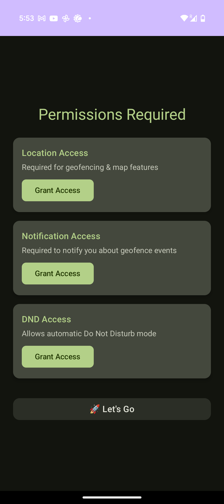
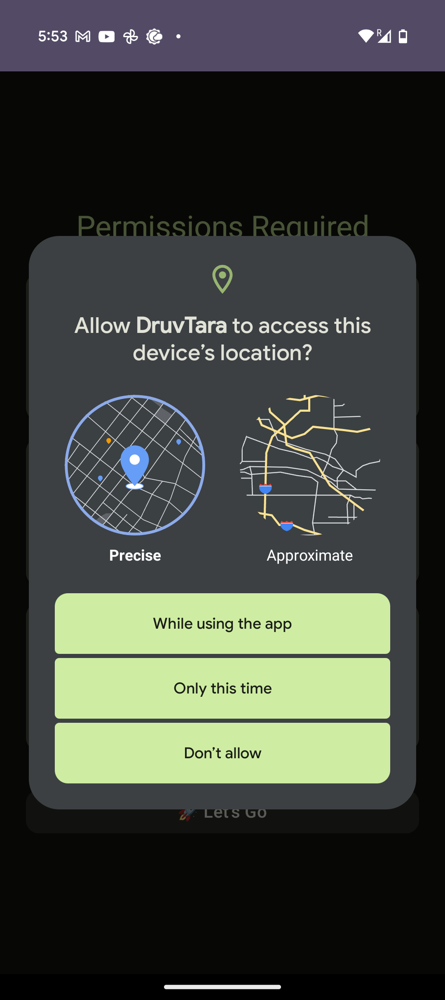
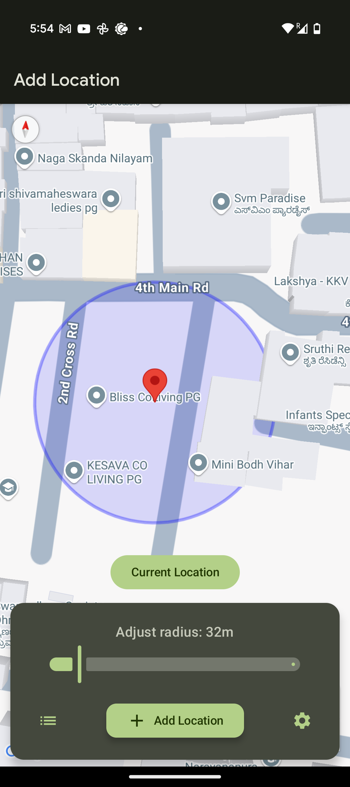
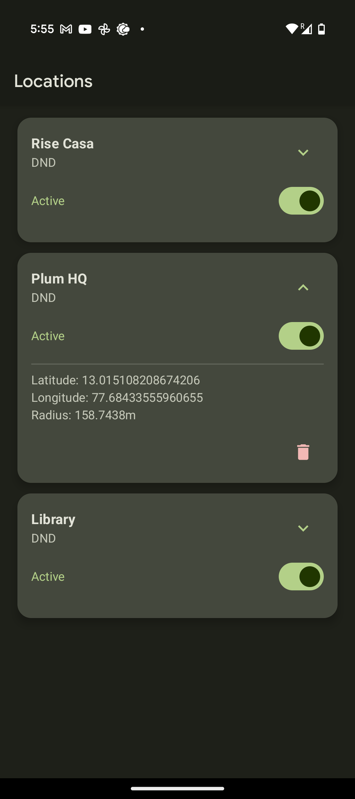
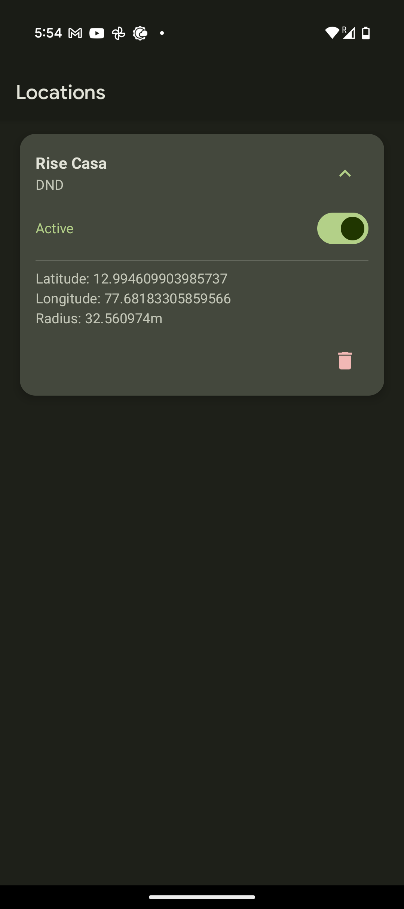
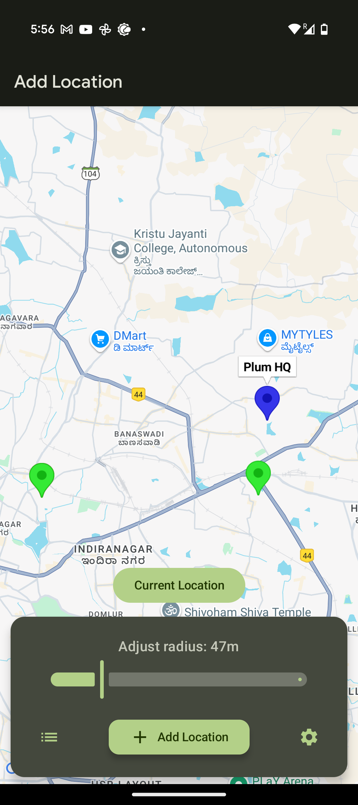

## ⁉️ Problem Statement
There are situations where users need to schedule tasks based on their location. For example:
Automatically enabling "Do Not Disturb" (DND) mode when arriving at a specific location and disabling it upon departure.
Sending a notification to a friend when approaching a designated place, such as a bus stop.
However, managing these tasks manually can be inconvenient and prone to human error, such as forgetting to disable DND after leaving a location.

# 🌟 **DhruvTara** 
A Location-Based Event Triggering App.
We propose developing **DhruvTara**, an Android application that enables users to schedule tasks and triggers based on their real-time location. The app will utilize **Android Foreground Services** to periodically check the user's location and execute predefined actions accordingly.  

## 🚀 **How It Works**  
DhruvTara notifies you, rings an alarm, or automatically toggles **Do Not Disturb (DND) mode** when you reach a predefined location. Never worry about missing an important place or forgetting to turn DND on/off when entering or exiting locations like libraries, offices, or quiet zones!  

## 📌 Features

- 📍 **Location-Based Alarms** - Get notified when you arrive at your destination.
- 🎛️ **Do Not Disturb (DND) Mode** - Enable/disable DND for specific locations.
- 🗑️ **Manage Locations** - Add, toggle, and remove locations effortlessly.

## 🛠️ Installation

- Clone the repository:
   ```sh
   git clone https://github.com/CosmoSailors/Dhruvtara.git
- Open the project in Android Studio.
- Build and run on an emulator or device.

## 📷 Screenshots
 
 
 


## 🏗️ Tech Stack

- 🏗️ Kotlin & Jetpack Compose
- 📍 [Google Maps SDK for Android](https://developers.google.com/maps/documentation/android-sdk)

## 🚀 Usage

- Open the app and grant location permissions.
- Add a location manually or use "Add Current Location."
- The app will notify you when you reach the selected place.
- Dismiss alarms using the "Dismiss" button.

## 📜 License

This project is licensed under the MIT License.
